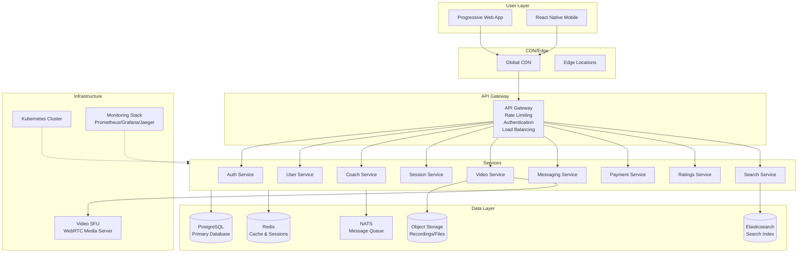
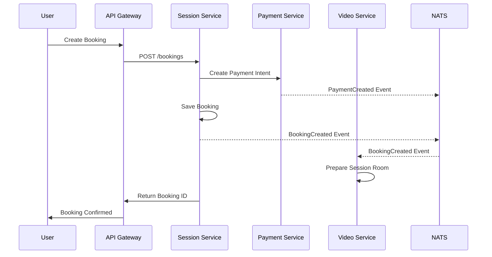

# Esport Coach Connect - Architecture Documentation

## Overview

Esport Coach Connect is a comprehensive platform that connects esports players with professional coaches for 1-on-1 sessions. This document outlines the system architecture, design decisions, and implementation details.

## Architecture Principles

### 1. Cloud-Agnostic Design
- Infrastructure as Code (Terraform) with provider abstractions
- Kubernetes for container orchestration
- Standard protocols and interfaces (S3 API, PostgreSQL, Redis)

### 2. Microservices Architecture
- Domain-driven service boundaries
- Independent deployability
- Fault isolation and resilience
- Event-driven communication

### 3. Scalability & Performance
- Horizontal auto-scaling
- Caching strategies (Redis)
- Database optimization
- CDN for static assets

### 4. Security First
- Zero-trust networking
- End-to-end encryption
- Identity and access management (OIDC/OAuth2)
- PCI-compliant payment processing

## System Overview



## Service Architecture

### 1. API Gateway
**Purpose**: Single entry point, routing, rate limiting, authentication
- **Technology**: Express.js/Envoy/Kong
- **Responsibilities**:
  - Request routing to microservices
  - Rate limiting and throttling
  - JWT token validation
  - Request/response transformation
  - API versioning

### 2. Auth Service
**Purpose**: Identity management and authentication
- **Technology**: Node.js + JWT + Redis
- **Features**:
  - User registration/login
  - JWT token generation/validation
  - Password hashing (bcrypt)
  - Session management
  - OAuth2/OIDC integration

### 3. User Service
**Purpose**: User profile management
- **Technology**: Node.js + PostgreSQL
- **Features**:
  - User profile CRUD operations
  - Preferences management
  - Account settings
  - Privacy controls

### 4. Coach Service
**Purpose**: Coach profiles and availability management
- **Technology**: Node.js + PostgreSQL
- **Features**:
  - Coach profile management
  - Availability scheduling
  - Skills and expertise tracking
  - Verification status management
  - Rating aggregation

### 5. Session Service
**Purpose**: Booking and session management
- **Technology**: Node.js + PostgreSQL + Redis
- **Features**:
  - Booking creation and management
  - Conflict detection
  - Session lifecycle management
  - Calendar integration
  - Reminder notifications

### 6. Video Service
**Purpose**: WebRTC session management
- **Technology**: Node.js + Janus SFU
- **Features**:
  - WebRTC session tokens
  - Video room management
  - Screen sharing control
  - Recording management
  - TURN/STUN coordination

### 7. Messaging Service
**Purpose**: Real-time communication
- **Technology**: Node.js + WebSocket + NATS
- **Features**:
  - Real-time chat
  - File sharing
  - Push notifications
  - Message history
  - Typing indicators

### 8. Payment Service
**Purpose**: Payment processing and billing
- **Technology**: Node.js + Stripe + PostgreSQL
- **Features**:
  - Payment intent creation
  - Escrow management
  - Payout processing
  - Refund handling
  - Invoice generation

### 9. Ratings Service
**Purpose**: Review and rating system
- **Technology**: Node.js + PostgreSQL
- **Features**:
  - Session rating submission
  - Review management
  - Rating aggregation
  - Reputation scoring
  - Moderation tools

### 10. Search Service
**Purpose**: Coach discovery and search
- **Technology**: Node.js + Elasticsearch
- **Features**:
  - Full-text search
  - Faceted search (games, price, rating)
  - Geo-location search
  - Search analytics
  - Recommendation engine

## Data Architecture

### Primary Database (PostgreSQL)
- **Use Case**: ACID transactions, relational data
- **Tables**: users, coaches, bookings, payments, ratings, messages
- **Features**:
  - Connection pooling (PgBouncer)
  - Read replicas for scaling
  - Automated backups
  - Point-in-time recovery

### Cache Layer (Redis)
- **Use Case**: Session storage, rate limiting, distributed locks
- **Patterns**:
  - Session store
  - Query result caching
  - Distributed locking
  - Real-time counters

### Search Index (Elasticsearch)
- **Use Case**: Full-text search, analytics
- **Indices**:
  - Coaches index with faceted search
  - Content search
  - Analytics data

### Object Storage (S3-Compatible)
- **Use Case**: File storage, video recordings
- **Buckets**:
  - Recordings (with lifecycle policies)
  - User uploads
  - Static assets

### Message Queue (NATS)
- **Use Case**: Event-driven communication
- **Patterns**:
  - Publish/Subscribe
  - Request/Reply
  - Work queues

## Event-Driven Architecture

### Event Flow


### Event Types
- **BookingCreated**: New booking confirmed
- **PaymentAuthorized**: Payment successfully authorized
- **SessionStarted**: Video session initiated
- **SessionCompleted**: Session finished
- **RatingSubmitted**: Post-session rating provided

## Security Architecture

### Authentication & Authorization
- **JWT Tokens**: Stateless authentication
- **RBAC**: Role-based access control (Player, Coach, Admin)
- **API Keys**: Service-to-service authentication
- **mTLS**: Secure inter-service communication

### Data Protection
- **Encryption in Transit**: TLS 1.3 everywhere
- **Encryption at Rest**: Database and storage encryption
- **PII Protection**: Sensitive data encryption
- **GDPR Compliance**: Data retention and deletion policies

### Network Security
- **Zero Trust**: Default deny, explicit allow
- **Network Policies**: Kubernetes network segmentation
- **DDoS Protection**: Rate limiting and traffic analysis
- **WAF**: Web Application Firewall

## Deployment Architecture

### Infrastructure as Code
```
infrastructure/
├── modules/
│   ├── network/        # VPC, subnets, security groups
│   ├── kubernetes/     # EKS/GKE/AKS cluster setup
│   ├── database/       # RDS/Cloud SQL setup
│   └── monitoring/     # Observability stack
├── environments/
│   ├── dev/           # Development configuration
│   ├── staging/       # Staging configuration
│   └── prod/          # Production configuration
└── main.tf           # Root configuration
```

### Kubernetes Deployment
```
kubernetes/
├── base/              # Base configurations
│   ├── database/      # Database deployments
│   ├── services/      # Application services
│   └── ingress/       # Ingress configuration
└── overlays/
    ├── dev/          # Development overrides
    ├── staging/      # Staging overrides
    └── prod/         # Production overrides
```

### CI/CD Pipeline
1. **Build**: Docker image creation
2. **Test**: Unit, integration, security tests
3. **Deploy**: Staged deployment (dev → staging → prod)
4. **Monitor**: Health checks and rollback capability

## Monitoring & Observability

### Metrics (Prometheus)
- **Golden Signals**: Latency, traffic, errors, saturation
- **Business Metrics**: Bookings, payments, user engagement
- **SLI/SLO**: Service level indicators and objectives

### Logging (Loki/ELK)
- **Structured Logging**: JSON format with trace correlation
- **Log Levels**: Error, warn, info, debug
- **Retention**: 30-day retention policy

### Tracing (Jaeger)
- **Distributed Tracing**: Request flow across services
- **Performance Analysis**: Bottleneck identification
- **Error Analysis**: Failure point identification

### Alerting (AlertManager)
- **SLO Violations**: Availability and performance alerts
- **Error Rate Spikes**: High error rate notifications
- **Infrastructure Issues**: Resource exhaustion alerts

## Scalability Considerations

### Horizontal Scaling
- **Stateless Services**: All services designed for horizontal scaling
- **Database Sharding**: Partition by user ID or geographic region
- **Caching Strategy**: Multi-level caching (application, Redis, CDN)

### Performance Optimization
- **Database Indexes**: Optimized for common query patterns
- **Connection Pooling**: Efficient database connection management
- **Async Processing**: Non-blocking operations where possible

### Traffic Management
- **Load Balancing**: Multiple load balancing strategies
- **Circuit Breakers**: Failure isolation and recovery
- **Rate Limiting**: API rate limiting and throttling

## Disaster Recovery

### Backup Strategy
- **Database**: Automated daily backups with point-in-time recovery
- **Object Storage**: Cross-region replication
- **Configuration**: Infrastructure and application config backups

### Recovery Procedures
- **RTO**: Recovery Time Objective < 1 hour
- **RPO**: Recovery Point Objective < 15 minutes
- **Failover**: Automated failover to secondary region

## Future Considerations

### Planned Enhancements
- **Machine Learning**: Coach recommendation engine
- **Mobile Apps**: Native iOS/Android applications  
- **Advanced Analytics**: Business intelligence and reporting
- **Multi-tenancy**: Support for multiple gaming organizations

### Scalability Roadmap
- **Global Deployment**: Multi-region deployment
- **Edge Computing**: Edge-based video processing
- **Microservice Mesh**: Service mesh implementation
- **Event Sourcing**: Event-driven data modeling

---

This architecture provides a solid foundation for a scalable, secure, and maintainable esports coaching platform while remaining flexible for future enhancements and requirements.